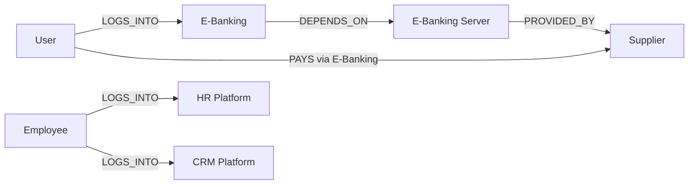

# Ticket Intelligence Ontology Notebook

Living design notebook for the UBS hackathon prototype. Update this file when we change the graph, email extraction schema, cluster rules, or demo story.

## 1. Product idea in one sentence

Turn a stream of operational emails into ontology-backed tickets and explainable issue clusters, then project each important cluster onto the affected part of the UBS operating graph so a risk user can see **what is affected, why it is being flagged, and what to do next**.

## 2. Demo promise

The end-to-end happy path should take less than two minutes:

1. Raw emails arrive in a simulated live stream.
2. Model pass 1 turns each email into a ticket containing the raw email and allowed ontology values.
3. Simple deterministic criteria group tickets into issue clusters.
4. A cluster reaches the critical threshold.
5. Model pass 2 creates the general issue description, possible cause, and suggested fix.
6. The affected nodes and relationships turn red on the ontology graph.
7. The user clicks the highlighted subgraph to inspect the cluster and its source emails.

Suggested demo incident:

> **Spike in E-Banking login failures after a mobile release**

This story is visually clear, maps cleanly to the initial ontology, and allows a convincing temporal root-cause hypothesis.

## 3. Design principles

- Keep the initial graph small enough to understand at a glance.
- Use stable IDs in code and human-readable labels in the UI.
- Preserve the original email behind every generated ticket and insight.
- Separate observations from model inferences.
- Express uncertainty: use “possible cause” unless the evidence proves causality.
- Never send credentials, personal data, or unredacted production emails to a model.
- Constrain model pass 1 to IDs and values defined by the ontology.
- Keep cluster formation and critical thresholds deterministic.
- Cache prepared model responses so the demo can recover gracefully from network or API failure.

## 4. Initial ontology scope

### Node types

| Type | Purpose | Initial nodes |
|---|---|---|
| `actor` | A party that interacts with a platform or another actor | User, Employee, Supplier |
| `platform` | A business-facing technology system | E-Banking, HR Platform, CRM Platform |
| `server` | Infrastructure on which a platform depends | E-Banking Server |

### Nodes

| Stable ID | Label | Type | Useful aliases in emails |
|---|---|---|---|
| `actor:user` | User | `actor` | customer, client, end user, mobile user |
| `actor:employee` | Employee | `actor` | staff, colleague, agent, adviser |
| `actor:supplier` | Supplier | `actor` | vendor, beneficiary, third party |
| `platform:e_banking` | E-Banking | `platform` | ebanking, e-bank, online banking, mobile banking |
| `platform:hr` | HR Platform | `platform` | HR portal, people portal, employee portal |
| `platform:crm` | CRM Platform | `platform` | CRM, client relationship platform |
| `server:ebanking_primary` | E-Banking Server | `server` | E-Banking host, backend server, application server, srv-eb-01 |

### Relationship types

Use directed relationships. A relationship can be affected even when both endpoint nodes remain healthy.

| Relationship | Meaning | Example |
|---|---|---|
| `LOGS_INTO` | An actor authenticates to a platform | Employee `LOGS_INTO` HR Platform |
| `PAYS` | One actor initiates a payment to another actor | User `PAYS` Supplier |
| `VIA` | An interaction is performed through a platform | Payment interaction `VIA` E-Banking |
| `DEPENDS_ON` | A platform requires infrastructure to operate | E-Banking `DEPENDS_ON` E-Banking Server |
| `PROVIDED_BY` | An infrastructure asset is supplied by an external party | E-Banking Server `PROVIDED_BY` Supplier |
| `OPERATED_BY` | An external party actively operates an asset | Server `OPERATED_BY` Supplier, when applicable |

For the first implementation, store `via_platform_id` as metadata on a `PAYS` edge instead of creating an extra payment-interaction node. This keeps the graph legible while preserving the meaning.

### Initial graph



### Initial edge records

| Stable ID | Source | Relationship | Target | Metadata |
|---|---|---|---|---|
| `edge:user_login_ebanking` | `actor:user` | `LOGS_INTO` | `platform:e_banking` | — |
| `edge:employee_login_hr` | `actor:employee` | `LOGS_INTO` | `platform:hr` | — |
| `edge:employee_login_crm` | `actor:employee` | `LOGS_INTO` | `platform:crm` | — |
| `edge:user_pays_supplier` | `actor:user` | `PAYS` | `actor:supplier` | `via_platform_id: platform:e_banking` |
| `edge:ebanking_depends_on_server` | `platform:e_banking` | `DEPENDS_ON` | `server:ebanking_primary` | `criticality: high` |
| `edge:server_provided_by_supplier` | `server:ebanking_primary` | `PROVIDED_BY` | `actor:supplier` | `contract_type: infrastructure` |

### Operational state of a server

The server is a persistent ontology node; “down” is a temporary runtime state, not a separate node or relationship. Keep the base ontology stable and attach the latest observed or inferred state as an overlay:

```json
{
  "node_id": "server:ebanking_primary",
  "operational_state": "down",
  "observed_at": "2026-09-22T09:24:00+02:00",
  "source_cluster_id": "cluster:ebanking_server_unreachable",
  "confidence": 0.93,
  "evidence": ["6 related connection failures", "health-check timeout in 5 tickets"]
}
```

Allowed prototype states are `healthy`, `degraded`, `down`, and `unknown`. Ticket evidence may infer a state, but the UI must label it as inferred unless it comes from an authoritative monitoring event.

### Important modelling assumption

This notebook currently assumes that “pays” means **a user pays a supplier through E-Banking**. Confirm this with the team. If the intended story is “UBS pays a supplier,” add an `organisation:ubs` node and make it the source instead of overloading User or Employee.

## 5. Context tags (not graph nodes in version 1)

Some dimensions are essential for clustering but would clutter the visual graph. Store these as ticket and cluster attributes first:

- `region`: e.g. `CH`, `EMEA`, `APAC`
- `channel`: e.g. `mobile_ios`, `mobile_android`, `web`, `api`
- `environment`: e.g. `production`, `test`
- `symptom`: e.g. `login_failure`, `timeout`, `duplicate_payment`, `server_unreachable`
- `error_code`: normalized code when available
- `release_id`: deployment or application version
- `occurred_at`: event timestamp
- `urgency`: urgency expressed in the email, if any

Promote a context tag into a graph node only if users regularly need to navigate or reason over it. For example, `service:authentication` may become a node later if several platforms share it.

## 6. Model pass 1: email-to-ticket contract

A ticket is fundamentally the immutable raw email plus the ontology values extracted from it. A short model-generated summary is included only as a convenience for display and the second model pass.

```json
{
  "id": "TCK-1042",
  "email_id": "EMAIL-1042",
  "received_at": "2026-09-22T09:14:00+02:00",
  "raw_email": "Since today's mobile update, several customers receive error A17 when signing in on iOS 27.1.",
  "summary": "Mobile users cannot log into E-Banking after an update.",
  "ontology_values": {
    "actor_ids": ["actor:user"],
    "platform_ids": ["platform:e_banking"],
    "server_ids": [],
    "supplier_ids": [],
    "edge_ids": ["edge:user_login_ebanking"],
    "relationship_types": ["LOGS_INTO"],
    "primary_affected_node_id": "platform:e_banking",
    "symptom": "login_failure",
    "region": "CH",
    "channel": "mobile_ios",
    "environment": "production",
    "error_code": "A17",
    "release_id": "mobile-6.4.0"
  },
  "extraction": {
    "confidence": 0.96,
    "evidence": ["customers", "error A17", "signing in", "iOS 27.1"]
  }
}
```

Model pass 1 must:

- return JSON matching a validated schema;
- select only IDs and controlled values supplied in the prompt;
- use `unknown`, `null`, or an empty list when the email does not provide a value;
- include short evidence fragments supporting its mapping;
- never create clusters or decide criticality.

Validate the response with Pydantic. If validation still fails after one retry, preserve the email as an `unclassified` ticket rather than dropping it.

## 7. Deterministic clustering and cluster contract

No second text-clustering model is required. Form a cluster from a simple ontology signature:

```text
primary affected node + relationship type + symptom
```

For example, tickets with `platform:e_banking + LOGS_INTO + login_failure` share a cluster. Use `region` or `channel` to split a cluster only when the demo story needs that distinction. Tickets missing the primary affected node or symptom remain unclassified for review.

```json
{
  "id": "cluster:login_ios_a17",
  "signature": "platform:e_banking|LOGS_INTO|login_failure",
  "status": "critical",
  "ticket_ids": ["TCK-1042", "TCK-1043", "TCK-1047"],
  "ticket_count": 8,
  "first_seen": "2026-09-22T09:12:00+02:00",
  "last_seen": "2026-09-22T09:24:00+02:00",
  "affected_subgraph": {
    "node_ids": ["actor:user", "platform:e_banking"],
    "edge_ids": ["edge:user_login_ebanking"],
    "direct_node_ids": ["actor:user", "platform:e_banking"],
    "propagated_node_ids": []
  },
  "shared_context": {
    "channel": "mobile_ios",
    "error_code": "A17",
    "release_id": "mobile-6.4.0"
  },
  "metrics": {
    "current_window_count": 8,
    "cluster_threshold": 3,
    "critical_threshold": 5,
    "window_minutes": 15
  },
  "analysis": {
    "generated_by": "model_pass_2",
    "title": "Spike in E-Banking login failures",
    "issue_description": "Eight emails report that mobile users cannot authenticate to E-Banking.",
    "possible_root_cause": "The failures may be related to mobile release 6.4.0.",
    "suggested_fix": "Compare authentication errors before and after release 6.4.0 and consider pausing the rollout.",
    "confidence": 0.78,
    "evidence": [
      "7 of 8 emails mention release 6.4.0",
      "the first report arrived 11 minutes after deployment",
      "all affected emails mention the iOS channel"
    ]
  }
}
```

## 8. Mapping a cluster to the graph

Use evidence from **all** tickets in a cluster rather than a single representative ticket.

1. Count each extracted ontology node and edge across cluster tickets.
2. Include an element when it appears in a configurable share of tickets (start with 50%).
3. Add connector elements required to make the selected subgraph understandable.
4. Attach the cluster ID, state, and ticket count to each highlighted element.
5. If several critical clusters affect the same element, show the highest severity and expose all clusters on click.

Distinguish **direct evidence** from **propagated impact**. If tickets and monitoring events identify the E-Banking Server as down, mark that server red. Follow incoming `DEPENDS_ON` relationships to show E-Banking as potentially impacted, and then show the connected login/payment paths. Use a different visual treatment, such as amber, for inferred downstream impact so the graph does not claim that every connected element has independently failed.

Example:

```text
8 similar tickets
  -> 8 mention E-Banking
  -> 7 describe login failure
  -> 7 affect mobile iOS
  -> highlight User --LOGS_INTO--> E-Banking
```

The `mobile_ios` attribute belongs in the detail panel, not necessarily as another visible graph node.

## 9. Critical-mass and emerging-pattern rules

For a reliable demo, start with transparent rules instead of an opaque risk score.

Suggested initial states:

| State | Rule |
|---|---|
| `normal` | Fewer than 3 tickets with the same ontology signature in the active window |
| `watch` | At least 3 tickets with the same ontology signature in 15 minutes |
| `critical` | At least 5 tickets with the same ontology signature in 15 minutes |
| `resolved` | No new related ticket for 30 minutes |

Additional safeguards:

- Show the actual threshold calculation in the detail panel.
- Do not let model confidence change the count; route very low-confidence tickets to `unclassified` instead.
- Keep thresholds configurable so the scripted email stream reliably crosses them.
- Label a pattern “recurring” when a similar cluster appears in at least two distinct time windows.
- Label a pattern “emerging” when it moves from `normal` to `watch` within the active window.

These are prototype defaults, not production risk policy.

## 10. Model pass 2: cluster explanation and suggested fix

Run the second model pass only when a cluster reaches `watch` or `critical`, not for every incoming email. Its input contains the cluster signature, shared ontology values, count and timeline, affected subgraph, ticket summaries, and relevant raw email text.

The model should rank hypotheses, not claim proof. Useful signals include:

1. **Temporal:** Did the issue begin shortly after a release, configuration change, or supplier event?
2. **Shared dependency:** Do affected graph paths share a system, server, service, or provider?
3. **Concentration:** Is the problem isolated to one channel, version, region, or error code?
4. **Contrast:** What is conspicuously unaffected? For example, web login works while iOS fails.
5. **Recurrence:** Did a similar cluster occur after an earlier release?

Every hypothesis in the UI should contain:

- a short statement;
- a confidence score or label;
- concrete supporting evidence;
- optionally, evidence that weakens the hypothesis;
- a safe validation step.

The second pass cannot change cluster membership, criticality, or graph IDs. It produces only the cluster title, general issue description, possible root cause, suggested fix, confidence, and evidence. Re-run it when the cluster first becomes critical or its membership changes materially; otherwise reuse the cached result.

## 11. Proposed prototype architecture

```text
Synthetic email stream
        |
        v
Model pass 1: email -> ontology ticket
        |
        v
Pydantic validation
        |
        v
Deterministic signature + time-window grouping
        |
        v
Threshold reached? ---- no ----> wait for next email
        |
       yes
        |
        +----> deterministic subgraph mapper
        |
        +----> model pass 2: description + cause + fix
                         |
                         v
          API -> interactive graph + detail panel
```

### Recommended implementation choices

- **Backend:** Python with FastAPI and Pydantic.
- **Graph storage:** versioned JSON files for the prototype; no graph database is needed.
- **Graph operations:** plain dictionaries initially, or NetworkX only when traversal becomes useful.
- **Model pass 1:** strict structured output constrained to the ontology and validated before storage.
- **Clustering:** a dictionary keyed by the ontology signature plus a rolling 15-minute window; no embeddings or clustering library is needed.
- **Model pass 2:** one grounded cluster-level call for the issue description, possible root cause, and suggested fix.
- **Frontend:** a small single-page app served by FastAPI with Cytoscape.js for the clickable graph. Vendor the JS asset before the demo so the UI does not depend on Wi-Fi.
- **Fallback:** store prepared valid outputs for the synthetic emails and headline cluster so the live demo survives an API failure.
- **Email stream:** replay timestamped synthetic emails from a JSON fixture at adjustable speed.

Avoid adding a graph database, message broker, embedding pipeline, or vector database for the hackathon version. They do not improve this focused demo flow.

## 12. Suggested API surface

| Method | Path | Purpose |
|---|---|---|
| `GET` | `/api/ontology` | Return nodes and edges for the graph |
| `GET` | `/api/node-states` | Return observed/inferred runtime states such as a server being down |
| `GET` | `/api/emails` | Return the recent raw email stream |
| `GET` | `/api/tickets` | Return tickets created by model pass 1 |
| `GET` | `/api/clusters` | Return cluster summaries and states |
| `GET` | `/api/clusters/{id}` | Return source tickets and model-pass-2 analysis |
| `POST` | `/api/demo/reset` | Reset the deterministic email replay |
| `POST` | `/api/demo/tick` | Emit the next email and process it into a ticket |

Server-sent events can be added later for live updates, but manual or timed polling is sufficient for a robust first demo.

## 13. Frontend behavior

- Default graph colors: actor = blue, platform = neutral grey, server = purple.
- `watch` elements: amber border/glow.
- `critical` elements: red border/glow with a small ticket-count badge.
- Directly failed elements should be red; elements affected through `DEPENDS_ON` should be amber until independently confirmed.
- Never rely on color alone; add an icon, border style, or text state.
- Clicking a highlighted node or edge opens the most relevant cluster.
- The detail panel should show, in this order:
  1. concise insight headline;
  2. impact and affected subgraph;
  3. why the alert fired;
  4. timeline/sparkline;
  5. evidence, extracted tickets, and source emails;
  6. possible root causes with confidence;
  7. recommended next actions.
- Keep the raw email stream visible beside or below the graph so the “noise to insight” transformation is obvious.

## 14. Demo dataset plan

Prepare roughly 25–40 synthetic emails. Each email becomes one ticket through model pass 1:

- 8 E-Banking iOS login failures sharing error `A17` after release `mobile-6.4.0`;
- 3 unrelated E-Banking emails to demonstrate separation;
- 4 HR login issues spread over a long period so they remain non-critical;
- 4 CRM issues with different symptoms;
- 5 payment/supplier emails, with only 2–3 genuinely related;
- 3–4 server connectivity emails that identify the supplier-provided E-Banking Server, enough to demonstrate dependency impact without competing with the main critical cluster;
- optional recurrence: a smaller historic E-Banking `A17` cluster after release `mobile-6.3.0`.

Ensure the stream contains paraphrases rather than duplicate text. The cluster should be convincing because the descriptions differ while the symptom and context align.

## 15. Definition of done for the first vertical slice

- [ ] Ontology loads from a JSON file and renders as a clickable graph.
- [ ] Synthetic emails replay in timestamp order.
- [ ] Model pass 1 produces a validated ontology ticket for every email.
- [ ] Tickets retain their immutable raw email and extracted ontology values.
- [ ] Matching E-Banking login signatures form one cluster without another model call.
- [ ] The cluster deterministically crosses the critical threshold.
- [ ] Model pass 2 produces the general issue description, evidence, possible cause, and suggested fix.
- [ ] User and E-Banking plus their login edge become highlighted.
- [ ] A server outage can highlight the server directly and its dependent platform as inferred impact.
- [ ] The server detail shows which supplier provides or operates it.
- [ ] Clicking the alert opens evidence, one or more hypotheses, and actions.
- [ ] The demo falls back to prepared cached model outputs when the network or AI API is unavailable.
- [ ] A teammate can start the app from README instructions.

## 16. Decisions and open questions

### Agreed or proposed decisions

| Date | Decision | Status |
|---|---|---|
| 2026-09-22 | Use a small property graph with stable IDs | Proposed |
| 2026-09-22 | Keep region/channel/release as attributes in version 1 | Proposed |
| 2026-09-22 | Use deterministic cluster signatures and thresholds | Agreed |
| 2026-09-22 | Use the mobile E-Banking login spike as the main demo story | Proposed |
| 2026-09-22 | Model servers as nodes with runtime health overlays and supplier relationships | Proposed |
| 2026-09-22 | Use one email-to-ticket model pass and one cluster-analysis model pass | Agreed |

### Questions for the team

- Does `PAYS` mean User pays Supplier through E-Banking, or UBS pays Supplier?
- Does a supplier merely provide each server, actively operate it, or both?
- Which model and structured-output interface will power the two passes?
- Which controlled symptom and context values should model pass 1 be allowed to return?
- Should a cluster highlight only directly extracted elements, or also upstream dependencies?
- What wording is acceptable for confidence and root-cause suggestions in the risk context?
- Is the demo guaranteed to have internet access?

## 17. Later extensions (not required for the first demo)

- Add `service`, `business_process`, `region`, `release`, and `supplier_system` node types.
- Add separate server instances for HR and CRM when their infrastructure becomes relevant to a demo story.
- Represent payments as event nodes when transaction-level reasoning is required.
- Add shared technical dependencies so impact can propagate upstream and downstream.
- Add embedding-based similarity only if ontology signatures later prove too coarse.
- Learn baselines by weekday and time of day.
- Capture analyst feedback on clusters, mappings, and hypotheses.
- Add alert acknowledgement, ownership, and audit history.
