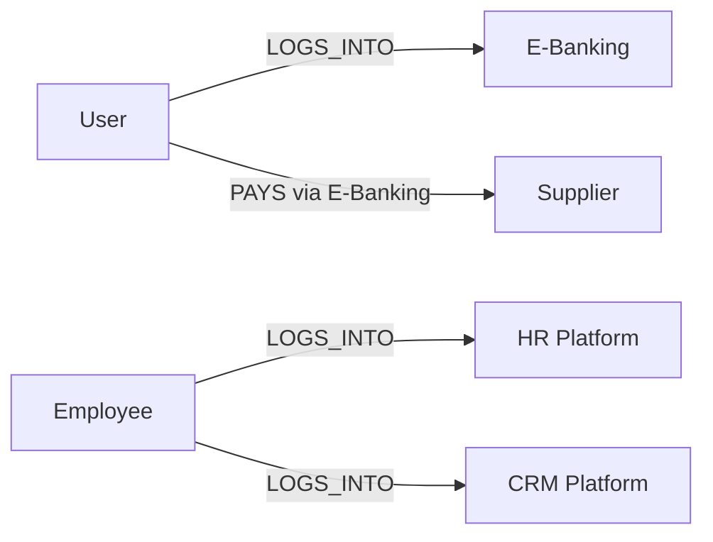

# Ticket Intelligence Ontology Notebook

Living design notebook for the UBS hackathon prototype. Update this file when we change the graph, ticket tags, alert rules, or demo story.

## 1. Product idea in one sentence

Turn a stream of operational tickets into explainable issue clusters, then project each important cluster onto the affected part of the UBS operating graph so a risk user can see **what is affected, why it is being flagged, and what to do next**.

## 2. Demo promise

The end-to-end happy path should take less than two minutes:

1. Raw tickets arrive in a simulated live stream.
2. Tickets receive ontology tags and join semantically similar clusters.
3. A cluster grows beyond its normal baseline and becomes critical.
4. The affected nodes and relationships turn red on the ontology graph.
5. The user clicks the highlighted subgraph.
6. A detail panel explains the theme, evidence, possible root causes, impact, and suggested actions.

Suggested demo incident:

> **Spike in E-Banking login failures after a mobile release**

This story is visually clear, maps cleanly to the initial ontology, and allows a convincing temporal root-cause hypothesis.

## 3. Design principles

- Keep the initial graph small enough to understand at a glance.
- Use stable IDs in code and human-readable labels in the UI.
- Preserve the original tickets behind every generated insight.
- Separate observations from model inferences.
- Express uncertainty: use “possible cause” unless the evidence proves causality.
- Never send credentials, personal data, or unredacted production tickets to a model.
- Make the demo deterministic; an LLM may enrich explanations but must not be required.

## 4. Initial ontology scope

### Node types

| Type | Purpose | Initial nodes |
|---|---|---|
| `actor` | A party that interacts with a platform or another actor | User, Employee, Supplier |
| `platform` | A business-facing technology system | E-Banking, HR Platform, CRM Platform |

### Nodes

| Stable ID | Label | Type | Useful aliases in tickets |
|---|---|---|---|
| `actor:user` | User | `actor` | customer, client, end user, mobile user |
| `actor:employee` | Employee | `actor` | staff, colleague, agent, adviser |
| `actor:supplier` | Supplier | `actor` | vendor, beneficiary, third party |
| `platform:e_banking` | E-Banking | `platform` | ebanking, e-bank, online banking, mobile banking |
| `platform:hr` | HR Platform | `platform` | HR portal, people portal, employee portal |
| `platform:crm` | CRM Platform | `platform` | CRM, client relationship platform |

### Relationship types

Use directed relationships. A relationship can be affected even when both endpoint nodes remain healthy.

| Relationship | Meaning | Example |
|---|---|---|
| `LOGS_INTO` | An actor authenticates to a platform | Employee `LOGS_INTO` HR Platform |
| `PAYS` | One actor initiates a payment to another actor | User `PAYS` Supplier |
| `VIA` | An interaction is performed through a platform | Payment interaction `VIA` E-Banking |

For the first implementation, store `via_platform_id` as metadata on a `PAYS` edge instead of creating an extra payment-interaction node. This keeps the graph legible while preserving the meaning.

### Initial graph



### Initial edge records

| Stable ID | Source | Relationship | Target | Metadata |
|---|---|---|---|---|
| `edge:user_login_ebanking` | `actor:user` | `LOGS_INTO` | `platform:e_banking` | — |
| `edge:employee_login_hr` | `actor:employee` | `LOGS_INTO` | `platform:hr` | — |
| `edge:employee_login_crm` | `actor:employee` | `LOGS_INTO` | `platform:crm` | — |
| `edge:user_pays_supplier` | `actor:user` | `PAYS` | `actor:supplier` | `via_platform_id: platform:e_banking` |

### Important modelling assumption

This notebook currently assumes that “pays” means **a user pays a supplier through E-Banking**. Confirm this with the team. If the intended story is “UBS pays a supplier,” add an `organisation:ubs` node and make it the source instead of overloading User or Employee.

## 5. Context tags (not graph nodes in version 1)

Some dimensions are essential for clustering but would clutter the visual graph. Store these as ticket and cluster attributes first:

- `region`: e.g. `CH`, `EMEA`, `APAC`
- `channel`: e.g. `mobile_ios`, `mobile_android`, `web`, `api`
- `environment`: e.g. `production`, `test`
- `symptom`: e.g. `login_failure`, `timeout`, `duplicate_payment`
- `error_code`: normalized code when available
- `release_id`: deployment or application version
- `occurred_at`: event timestamp
- `severity`: source-ticket severity

Promote a context tag into a graph node only if users regularly need to navigate or reason over it. For example, `service:authentication` may become a node later if several platforms share it.

## 6. Ticket contract

Keep source data and derived data distinct.

```json
{
  "id": "TCK-1042",
  "occurred_at": "2026-09-22T09:14:00+02:00",
  "title": "Mobile client cannot log in after update",
  "description": "Authentication returns error A17 on iOS 27.1.",
  "source": "demo_stream",
  "source_severity": "medium",
  "context": {
    "region": "CH",
    "channel": "mobile_ios",
    "environment": "production",
    "error_code": "A17",
    "release_id": "mobile-6.4.0"
  },
  "ontology_tags": {
    "node_ids": ["actor:user", "platform:e_banking"],
    "edge_ids": ["edge:user_login_ebanking"],
    "symptoms": ["login_failure"],
    "tagging_method": "rules",
    "confidence": 0.96
  }
}
```

Rules can supply the first ontology tags by matching aliases, error codes, and known source systems. A model can add or correct tags later, but should always return confidence and evidence.

## 7. Cluster contract

```json
{
  "id": "cluster:login_ios_a17",
  "label": "E-Banking iOS login failures",
  "status": "critical",
  "ticket_ids": ["TCK-1042", "TCK-1043", "TCK-1047"],
  "ticket_count": 8,
  "first_seen": "2026-09-22T09:12:00+02:00",
  "last_seen": "2026-09-22T09:24:00+02:00",
  "affected_subgraph": {
    "node_ids": ["actor:user", "platform:e_banking"],
    "edge_ids": ["edge:user_login_ebanking"]
  },
  "shared_context": {
    "channel": "mobile_ios",
    "error_code": "A17",
    "release_id": "mobile-6.4.0"
  },
  "metrics": {
    "current_window_count": 8,
    "baseline_window_count": 2,
    "spike_ratio": 4.0,
    "cluster_cohesion": 0.84
  },
  "root_cause_hypotheses": [
    {
      "statement": "Mobile release 6.4.0 may have introduced an authentication regression.",
      "confidence": 0.78,
      "evidence": [
        "7 of 8 tickets report release 6.4.0",
        "the first ticket appeared 11 minutes after deployment",
        "all affected tickets use the iOS channel"
      ]
    }
  ],
  "recommended_actions": [
    "Compare authentication errors before and after release 6.4.0",
    "Notify the E-Banking mobile owner",
    "Consider pausing the rollout while the regression is investigated"
  ]
}
```

## 8. Mapping a cluster to the graph

Use evidence from **all** tickets in a cluster rather than a single representative ticket.

1. Count each tagged node and edge across cluster tickets.
2. Include an element when it appears in a configurable share of tickets (start with 50%).
3. Add connector elements required to make the selected subgraph understandable.
4. Attach the cluster ID, state, score, and ticket count to each highlighted element.
5. If several critical clusters affect the same element, show the highest severity and expose all clusters on click.

Example:

```text
8 similar tickets
  -> 8 mention E-Banking
  -> 7 describe login failure
  -> 7 affect mobile iOS
  -> highlight User --LOGS_INTO--> E-Banking
```

The `mobile_ios` attribute belongs in the detail panel, not necessarily as another visible graph node.

## 9. Critical-mass and emerging-pattern rules

For a reliable demo, start with transparent rules instead of an opaque risk score.

Suggested initial states:

| State | Rule |
|---|---|
| `normal` | Fewer than 3 related tickets in the active window |
| `watch` | At least 3 related tickets in 15 minutes |
| `critical` | At least 5 related tickets in 15 minutes **and** at least 2× the historical/demo baseline |
| `resolved` | No new related ticket for a configured cool-down period |

Additional safeguards:

- Require reasonable cluster cohesion before raising an alert.
- Do not divide by zero when the baseline is empty; use a minimum baseline of 1.
- Show the actual threshold calculation in the detail panel.
- Keep thresholds configurable so the scripted ticket stream reliably crosses them.
- Label a pattern “recurring” when a similar cluster appears in at least two distinct time windows.
- Label a pattern “emerging” when recent growth is high and the theme was previously rare.

These are prototype defaults, not production risk policy.

## 10. Root-cause reasoning

The system should rank hypotheses, not claim proof. Useful signals include:

1. **Temporal:** Did the issue begin shortly after a release, configuration change, or supplier event?
2. **Shared dependency:** Do affected graph paths share a system, service, or provider?
3. **Concentration:** Is the problem isolated to one channel, version, region, or error code?
4. **Contrast:** What is conspicuously unaffected? For example, web login works while iOS fails.
5. **Recurrence:** Did a similar cluster occur after an earlier release?

Every hypothesis in the UI should contain:

- a short statement;
- a confidence score or label;
- concrete supporting evidence;
- optionally, evidence that weakens the hypothesis;
- a safe validation step.

## 11. Proposed prototype architecture

```text
Synthetic ticket stream
        |
        v
Normalizer + ontology tagger
        |
        v
Text/context clusterer -----> Trend and recurrence detector
        |                                  |
        +----------------+-----------------+
                         v
                 Subgraph mapper
                         |
                         v
              Insight/explanation builder
                         |
                         v
          API -> interactive graph + detail panel
```

### Recommended implementation choices

- **Backend:** Python with FastAPI and Pydantic.
- **Graph storage:** versioned JSON files for the prototype; no graph database is needed.
- **Graph operations:** plain dictionaries initially, or NetworkX only when traversal becomes useful.
- **Clustering:** TF-IDF plus cosine similarity/agglomerative clustering, weighted with ontology/context tags. It is fast, explainable, and works offline.
- **Frontend:** a small single-page app served by FastAPI with Cytoscape.js for the clickable graph. Vendor the JS asset before the demo so the UI does not depend on Wi-Fi.
- **Explanations:** deterministic templates first; optional LLM enrichment behind a feature flag with a fallback.
- **Ticket stream:** replay a timestamped JSON fixture at adjustable speed.

Avoid adding a graph database, message broker, or mandatory external AI API for the hackathon version. They add setup and demo failure modes without improving the core story.

## 12. Suggested API surface

| Method | Path | Purpose |
|---|---|---|
| `GET` | `/api/ontology` | Return nodes and edges for the graph |
| `GET` | `/api/tickets` | Return recent raw/tagged tickets |
| `GET` | `/api/clusters` | Return cluster summaries and states |
| `GET` | `/api/clusters/{id}` | Return evidence, hypotheses, and actions |
| `POST` | `/api/demo/reset` | Reset the deterministic ticket replay |
| `POST` | `/api/demo/tick` | Emit the next ticket or batch |

Server-sent events can be added later for live updates, but manual or timed polling is sufficient for a robust first demo.

## 13. Frontend behavior

- Default graph colors: actor = blue, platform = neutral grey.
- `watch` elements: amber border/glow.
- `critical` elements: red border/glow with a small ticket-count badge.
- Never rely on color alone; add an icon, border style, or text state.
- Clicking a highlighted node or edge opens the most relevant cluster.
- The detail panel should show, in this order:
  1. concise insight headline;
  2. impact and affected subgraph;
  3. why the alert fired;
  4. timeline/sparkline;
  5. evidence and sample tickets;
  6. possible root causes with confidence;
  7. recommended next actions.
- Keep the raw ticket stream visible beside or below the graph so the “noise to insight” transformation is obvious.

## 14. Demo dataset plan

Prepare roughly 25–40 synthetic tickets:

- 8 E-Banking iOS login failures sharing error `A17` after release `mobile-6.4.0`;
- 3 unrelated E-Banking tickets to demonstrate separation;
- 4 HR login issues spread over a long period so they remain non-critical;
- 4 CRM issues with different symptoms;
- 5 payment/supplier tickets, with only 2–3 genuinely related;
- optional recurrence: a smaller historic E-Banking `A17` cluster after release `mobile-6.3.0`.

Ensure the stream contains paraphrases rather than duplicate text. The cluster should be convincing because the descriptions differ while the symptom and context align.

## 15. Definition of done for the first vertical slice

- [ ] Ontology loads from a JSON file and renders as a clickable graph.
- [ ] Synthetic tickets replay in timestamp order.
- [ ] Tickets carry node, edge, symptom, and context tags.
- [ ] Similar E-Banking login tickets form one cluster.
- [ ] The cluster deterministically crosses the critical threshold.
- [ ] User and E-Banking plus their login edge become highlighted.
- [ ] Clicking the alert opens evidence, one or more hypotheses, and actions.
- [ ] The system still works without network access or an AI API key.
- [ ] A teammate can start the app from README instructions.

## 16. Decisions and open questions

### Agreed or proposed decisions

| Date | Decision | Status |
|---|---|---|
| 2026-09-22 | Use a small property graph with stable IDs | Proposed |
| 2026-09-22 | Keep region/channel/release as attributes in version 1 | Proposed |
| 2026-09-22 | Use deterministic thresholds and explanations as fallback | Proposed |
| 2026-09-22 | Use the mobile E-Banking login spike as the main demo story | Proposed |

### Questions for the team

- Does `PAYS` mean User pays Supplier through E-Banking, or UBS pays Supplier?
- Are ontology tags already present in the supplied ticket data, or must we extract all of them?
- Which ticket fields and timestamps are guaranteed to exist?
- Should a cluster highlight only directly tagged elements, or also upstream dependencies?
- What wording is acceptable for confidence and root-cause suggestions in the risk context?
- Is the demo guaranteed to have internet access?

## 17. Later extensions (not required for the first demo)

- Add `service`, `business_process`, `region`, `release`, and `supplier_system` node types.
- Represent payments as event nodes when transaction-level reasoning is required.
- Add shared technical dependencies so impact can propagate upstream and downstream.
- Replace or augment TF-IDF with embeddings after the full offline flow works.
- Learn baselines by weekday and time of day.
- Capture analyst feedback on clusters, mappings, and hypotheses.
- Add alert acknowledgement, ownership, and audit history.

